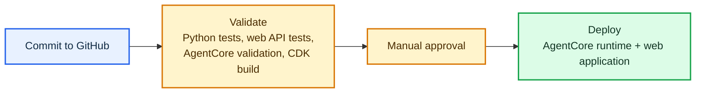

# AWS Cost Assistant

A secure, plain-English interface for answering AWS cost questions from live,
read-only AWS Cost Explorer data.

Instead of asking people to navigate Cost Explorer, select dates, and interpret
charts, this application lets an approved user ask a question such as:

> Which AWS services are driving my month-to-date cost?

The assistant responds with the reporting period, whether AWS considers the
data estimated, and a clear cost summary. It never creates, changes, or
deletes AWS resources.

## What it does today

- Reports current-month unblended cost through the last completed day.
- Identifies the AWS services driving current-month spend.
- States the reporting period and estimated-data status.
- Uses only read-only Cost Explorer calls.
- Provides a normal browser experience — no CLI or JSON knowledge required.

Questions about a specific environment are a planned capability. They require
an activated `Environment` cost-allocation tag first.

## High-level architecture

```mermaid
flowchart LR
    U([User]) -->|HTTPS| W[Cost Assistant<br/>web page]
    U -->|Sign in| C[Cognito<br/>user pool]
    C -->|JWT| W
    W -->|Authenticated question| A[API Gateway]
    A --> L[Lambda<br/>secure adapter]
    L -->|Scoped IAM permission| R[Amazon Bedrock<br/>AgentCore Runtime]
    R --> S[Strands agent<br/>orchestration]
    S --> N[Amazon Nova 2 Lite]
    S --> CE[AWS Cost Explorer]

    G[GitHub] --> P[CodePipeline]
    P --> B[CodeBuild<br/>tests and validation]
    B --> M[Manual approval]
    M --> R
    M --> W

    classDef user fill:#E8F1FF,stroke:#2563EB,color:#102A43,stroke-width:2px;
    classDef experience fill:#DCFCE7,stroke:#16A34A,color:#123524,stroke-width:2px;
    classDef security fill:#FFF4CC,stroke:#D97706,color:#4A2C00,stroke-width:2px;
    classDef agent fill:#F3E8FF,stroke:#9333EA,color:#3B0764,stroke-width:2px;
    classDef delivery fill:#FFE4E6,stroke:#E11D48,color:#4C0519,stroke-width:2px;

    class U user;
    class W experience;
    class C,A,L security;
    class R,S,N,CE agent;
    class G,P,B,M delivery;
```



### Why this design

- **No AWS credentials in the browser.** Cognito authenticates the user, and
  API Gateway checks the user token before a request reaches the backend.
- **Least privilege.** The browser-facing Lambda can invoke only this
  assistant's `DEFAULT` AgentCore endpoint. The agent execution role has
  read-only Cost Explorer access.
- **A real user experience.** Users type everyday questions into a browser;
  AgentCore is the secure runtime behind the experience, not the user
  interface itself.
- **Controlled releases.** Every GitHub push runs automated checks. A manual
  approval separates validation from production deployment.

## Example questions

- “What is my AWS month-to-date cost?”
- “Which AWS services are driving my month-to-date cost?”
- “List my top AWS cost drivers for this month.”
- “Is my current AWS cost estimated, and what reporting period does it cover?”

## Delivery pipeline



## Technology

| Area | Services and tools |
| --- | --- |
| Agent | Amazon Bedrock AgentCore, Strands Agents SDK, Amazon Nova 2 Lite |
| Cost data | AWS Cost Explorer (`GetCostAndUsage`, read-only) |
| Web application | CloudFront, private S3 origin, API Gateway, Lambda |
| Authentication | Amazon Cognito |
| Infrastructure | AWS CDK and CloudFormation |
| Delivery | GitHub, AWS CodePipeline, CodeBuild, manual approval |
| Language | Python for the agent and API adapter; TypeScript for CDK |

## Project structure

```text
app/calculatoragent/        Strands agent and Cost Explorer tools
web/public/                 Browser application
web/backend/                Authenticated Lambda API adapter
agentcore/                  AgentCore configuration and CDK infrastructure
iam/                        Scoped policy used by the deployment build
buildspec.yml               Validation build commands
buildspec-deploy.yml        Manually approved deployment commands
```

## Local development and validation

Prerequisites: Python 3.10+, [uv](https://docs.astral.sh/uv/), Node.js 20+,
the AgentCore CLI, and configured AWS credentials.

```bash
# Run the agent locally
agentcore dev --logs

# Run agent tests
cd app/calculatoragent
uv sync
uv run python -m unittest discover -s tests -v

# Run web adapter tests
cd ../../web/backend
python3 -m unittest discover -s . -p "test_*.py" -v
```

## Deployment model

The repository is the source of truth. A GitHub push starts the validation
pipeline; deployment occurs only after manual approval. The CDK bootstrap
environment is required once per AWS account and Region so CodeBuild can deploy
the CloudFormation assets safely.

## Learning outcomes

This project demonstrates how to:

- Build a tool-using Strands agent on AgentCore Runtime.
- Apply least-privilege IAM across an agent, web API, and delivery pipeline.
- Turn a streaming AgentCore response into a browser-friendly API response.
- Add Cognito authentication without exposing AWS credentials to users.
- Use CodePipeline and CodeBuild for validated, manually approved releases.

## Notes

- Cost Explorer data can be delayed and AWS may mark recent values as estimated.
- Cost Explorer API requests, model inference, AgentCore runtime use, and
  pipeline executions can incur AWS charges. Use AWS Budgets and Cost Explorer
  to monitor the account.
- This project intentionally has no public self-registration. Create approved
  users in the deployed Cognito user pool.
